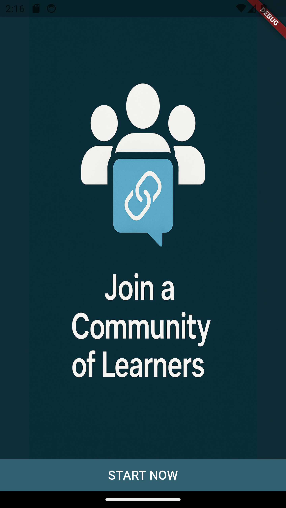
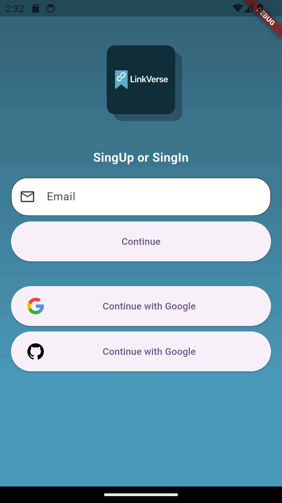
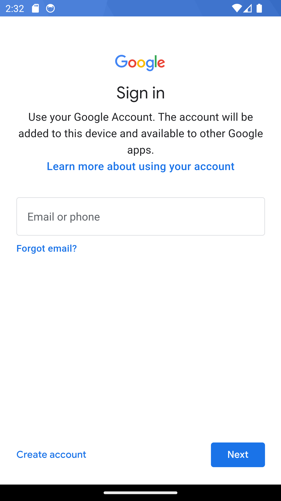
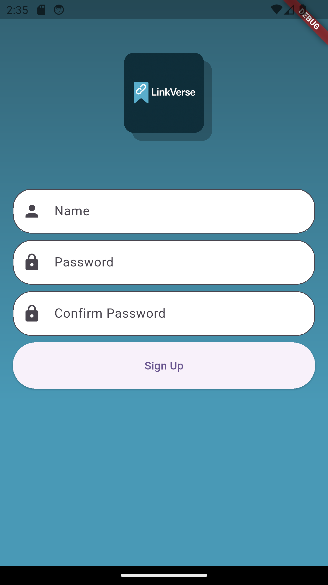
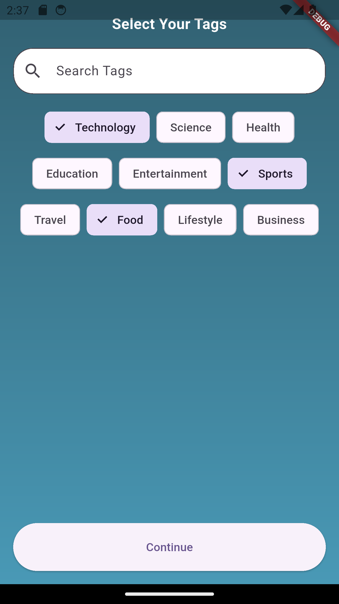
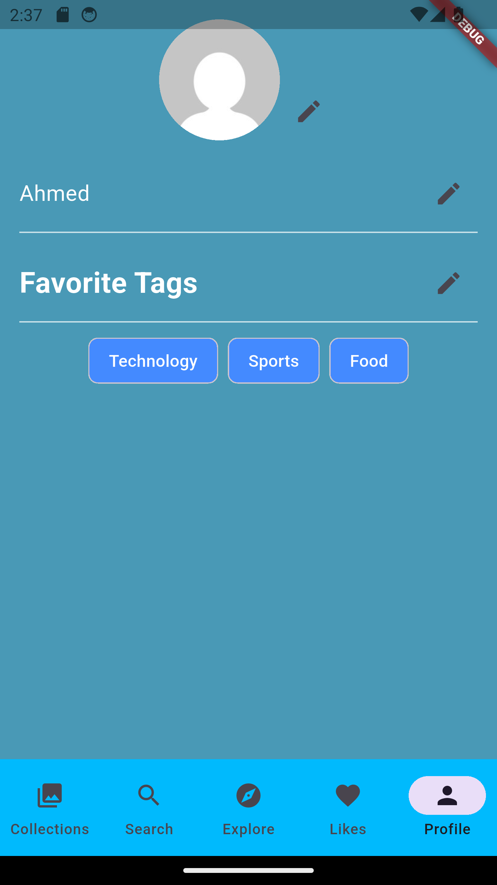
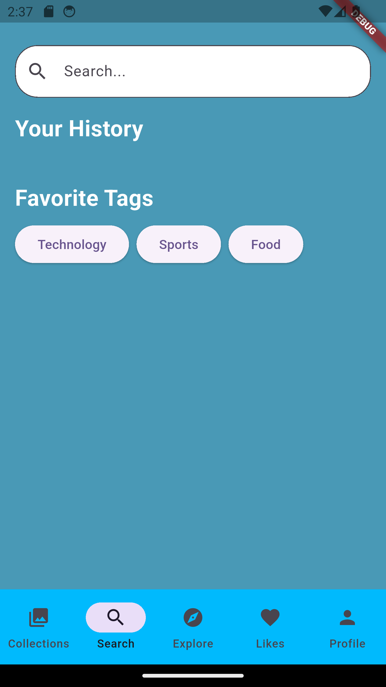
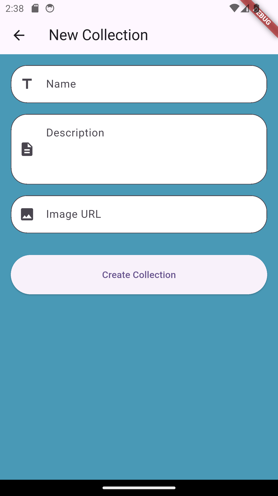

# LinkVerse - Detailed Product Specification

## 1. Project Overview

- **Project Name:** LinkVerse  
- **Type:** Mobile-first social bookmarking and micro-learning platform  
- **Platform:** Flutter (cross-platform: Android & iOS)  
- **Purpose:** Empower users to save, organize, and share useful learning links, while leveraging community-curated collections and AI-generated content summaries.

---

## 2. Goals & Objectives

- Provide users with a centralized platform to bookmark and organize educational resources.  
- Enhance discovery of valuable learning materials via community contributions.  
- Use AI to generate content summaries and categorize links intelligently.  
- Allow micro-learning through bite-sized, curated content feeds.

---

## 3. Target Audience

- Students and self-learners  
- Developers, designers, and researchers  
- Educators and knowledge workers

---

## 4. Features & Requirements

### 4.1 User Authentication

- Sign Up / Sign In via:
  - Email/password  
  - Google OAuth2  
  - GitHub OAuth2  
- Onboarding:
  - Select topic interests  

### 4.2 Bookmark Management

- **Add Link:**
  - Input URL 
  - User can add tags, custom title/notes  

- **Organize Bookmarks:**
  - Create folders/collections 

- **Link View:**
  - AI-generated summary (via GPT API)

### 4.3 Micro-Learning Feed

- **Daily Feed:**
  - Personalized feed based on selected interests  

- **Short Notes Mode:**
  - View AI-generated summaries only

### 4.4 Community Collections

- **Create Public Collections:**
  - Name, description, cover image  
  - Add bookmarks  

- **Explore Collections:**
  - View trending collections

### 4.5 Search & Filtering

- **Search Bar:**
  - Global search for bookmarks

### 4.6 User Profiles

- Profile Page:
  - Username, bio, interests

### 4.8 AI Integration

- **Summarization API (GPT/Gemini):**
  - Article or video summary in ~3 sentences  
- **Auto-tagging:**
  - Suggest tags based on content

---

## 5. Technical Specifications

### 5.1 Frontend (Flutter)

### 5.2 Backend: Firebase Stack

## 6. Screenshots

